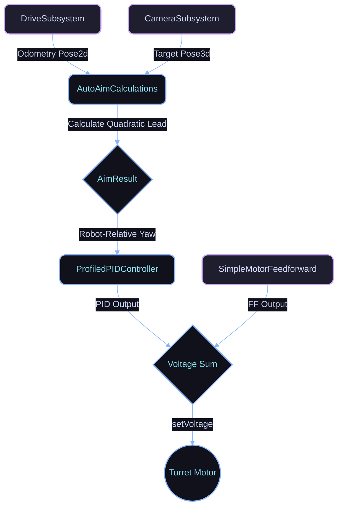
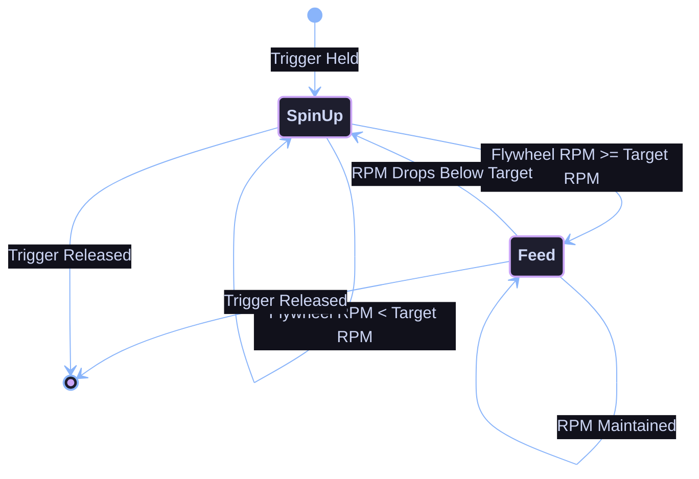

<a name="readme-top"></a>

<div align="center">

# 2026-bot
**Miami Beach Bots (FRC Team 2026)**

*Aut viam inveniam aut faciam.*

[]()
[]()
[](https://github.com/MiamiBeachBots/2026-bot/actions)
[](https://github.com/MiamiBeachBots/2026-bot)
[](https://github.com/MiamiBeachBots/2026-bot/commits/main)

</div>

---

## Table of Contents
- [Project Status](#project-status)
- [Quick Start](#quick-start)
  - [Prerequisites](#prerequisites)
  - [Installation \& Branching](#installation--branching)
- [Build \& Deploy](#build--deploy)
- [Project Structure](#project-structure)
- [Documentation](#documentation)
- [CAN Bus Map](#can-bus-map)
- [Roadmap \& TODO](#roadmap--todo)
- [Team \& Sponsors](#team--sponsors)

---

## Project Status

**Current State:** Pre-Alpha / In Development

> [!NOTE]
> This codebase is under active development for the 2025-2026 FRC season.

* **[Complete]** Tank drive base initialized
* **[Complete]** Basic project structure and dependencies configured
* **[Warning]** Tank base untested
* **[Pending]** Major subsystems pending implementation

<p align="right"><a href="#readme-top">Back to top</a></p>

---

## Quick Start

### Prerequisites

Ensure you have the following installed before setting up the project:

* **Java Development Kit (JDK):** Version 17 or higher
* **WPILib Suite:** 2025 release
* **Git:** For version control

### Installation & Branching

We use a branching model for all features rather than relying on forks. All contributors should clone the main repository directly and branch off of `main`.

1. **Clone the repository:**
   ```bash
   git clone https://github.com/MiamiBeachBots/2026-bot.git
   cd 2026-bot
   ```

2. **Create a feature branch:**
   ```bash
   git checkout -b feature/your-feature-name
   ```

3. **Build the project:**
   ```bash
   ./gradlew build
   ```
   This command downloads all required vendor dependencies and compiles the code.

4. **Push your changes and open a Pull Request:**
   ```bash
   git add .
   git commit -m "Brief description of changes"
   git push -u origin feature/your-feature-name
   ```

<details>
<summary><strong>View Vendor Dependencies</strong></summary>

This project uses the following vendor libraries (automatically managed via `vendordeps/`):

| Vendor | Library | Description |
|---|---|---|
| **CTRE** | Phoenix 6 | Motor controllers and sensors |
| **CTRE** | Phoenix 5 | Legacy CTRE devices |
| **REV Robotics** | REVLib | Spark MAX motor controllers |
| **Redux** | ReduxLib | Additional utilities |
| **Studica** | Studica | Additional hardware support |
| **ThriftyBot** | ThriftyLib | Encoder support |
| **Maple** | Maple-Sim | Simulation utilities |

</details>

<p align="right"><a href="#readme-top">Back to top</a></p>

---

## Build & Deploy

### Building the Code

Compile the robot code locally:

```bash
./gradlew build
```

### Deploying to Robot

1. **Connect to the robot** via WiFi (10.20.26.1) or Ethernet.
2. **Deploy the code:**
   ```bash
   ./gradlew deploy
   ```

### Running Simulation

Test the code without a physical robot:

```bash
./gradlew simulateJava
```

<p align="right"><a href="#readme-top">Back to top</a></p>

---

## Project Structure

<details open>
<summary><strong>Directory Layout</strong></summary>

```text
2026-bot/
├── src/main/java/frc/robot/    # Robot source code
│   ├── Robot.java              # Main robot class
│   ├── RobotContainer.java     # Command and subsystem initialization
│   └── subsystems/             # Robot subsystems
├── src/main/deploy/            # Configuration files
├── vendordeps/                 # Vendor dependency JSON files
├── build.gradle                # Gradle build configuration
└── README.md                   # This file
```

</details>

<p align="right"><a href="#readme-top">Back to top</a></p>

## System Architecture

### Auto Aim Pipeline


### Fire Control State Machine


<p align="right"><a href="#readme-top">Back to top</a></p>

---

## Documentation

* **[Contributing Guide](Contribguide.md)** - How to contribute to this project
* **[Style Guide](styleguide.md)** - Code formatting and naming conventions
* **[Commit Guide](commitguide.md)** - Git commit message standards
* **[Assist Guide](Assist.md)** - How to get help and report issues

<p align="right"><a href="#readme-top">Back to top</a></p>

---

## CAN Bus Map

> [!NOTE]
> This is what we will be doing
> [!ALERT]
> CAN is currently not working but the can ids are being set

| CAN ID | Subsystem | Device/Motor Name | Type |
|:---|:---|:---|:---|
| 1  | DriveTrain | Front Right Motor | NEO Brushless |
| 2  | DriveTrain | Back Right Motor | NEO Brushless |
| 3  | DriveTrain | Front Left Motor | NEO Brushless |
| 4  | DriveTrain | Back Left Motor | NEO Brushless |
| 5  | Intake | Intake Main Motor | NEO Brushless |
| 6  | Intake | Intake Secondary Motor | NEO Brushless |
| 7  | Loader | Loader Loader Motor 1 | NEO Brushless |
| 8  | Loader | Loader Loader Motor 2 | NEO Brushless |
| 9  | Loader | Loader Loader Motor 3 | NEO Brushless |
| 10 | Turret | Turret Rotation Motor | NEO Brushless |
| 11 | FireControl | Fire Kicker Motor | NEO Brushless |

<p align="right"><a href="#readme-top">Back to top</a></p>

---

## Roadmap \& TODO

* [x] **Hardware Integration**
  * [x] Verify tank drive motor CAN IDs and configurations
  * [x] Test individual drive motors
  * [x] Verify encoder directions
* [ ] **Subsystems**
  * [x] Initialize empty subsystems and placeholder files
  * [ ] Complete tank drive testing
  * [ ] Calibrate FireControlSubsystem Motor Speeds
  * [ ] Implement additional mechanisms (TBD based on game)
* [ ] **Autonomous**
  * [x] Initialize AutoAimCommand structure
  * [ ] Configure PathPlanner
  * [ ] Develop autonomous routines (Left, Right, Center Paths)
* [x] **Vision & Coprocessor**
  * [x] Set up vision processing (Limelight/PhotonVision)
  * [x] Implement AprilTag tracking algorithms
* [x] **Driver Station**
  * [x] Configure primary controller mappings
  * [x] Configure secondary operator mappings
  * [x] Set up SmartDashboard feedback telemetry
* [ ] **Documentation**
  * [x] Finalize `README.md` structure and badges
  * [x] Complete CAN bus map
  * [ ] Document electrical connections and wire routing
  * [ ] Add subsystem and command JavaDoc documentation

<p align="right"><a href="#readme-top">Back to top</a></p>

---

## Team & Sponsors

### Miami Beach Bots (FRC Team 2026)
*Miami Beach, Florida*

We are extremely grateful for the generous support of our sponsors. Their contributions make this project possible:

<div align="center">

| | | |
|:---:|:---:|:---:|
| **Gene Haas Foundation** | **Waldom Electronics** | **Give Miami Day** |
| **Intuitive Foundation** | **MDCPS** | **Cordyceps Systems** |
| **MBSH PTSA** | **FIRST Robotics** | **Metal Supermarkets** |

</div>

> [!NOTE]
> If you are interested in sponsoring our team, please reach out to our team administration!

<div align="center">
  <br>
  <i>Built by Miami Beach Bots</i>
</div>
## Installation Instructions
For complete cross-platform developer provisioning and compilation steps, please view the fully detailed [`deploy-guide.md`](deploy-guide.md).
